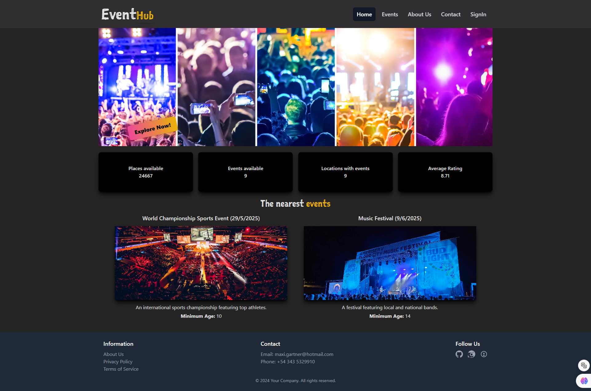
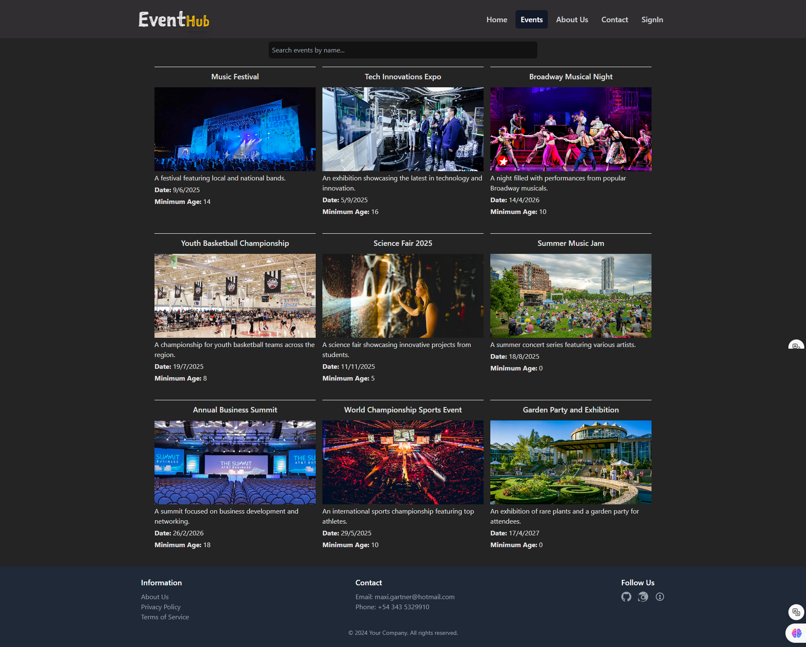
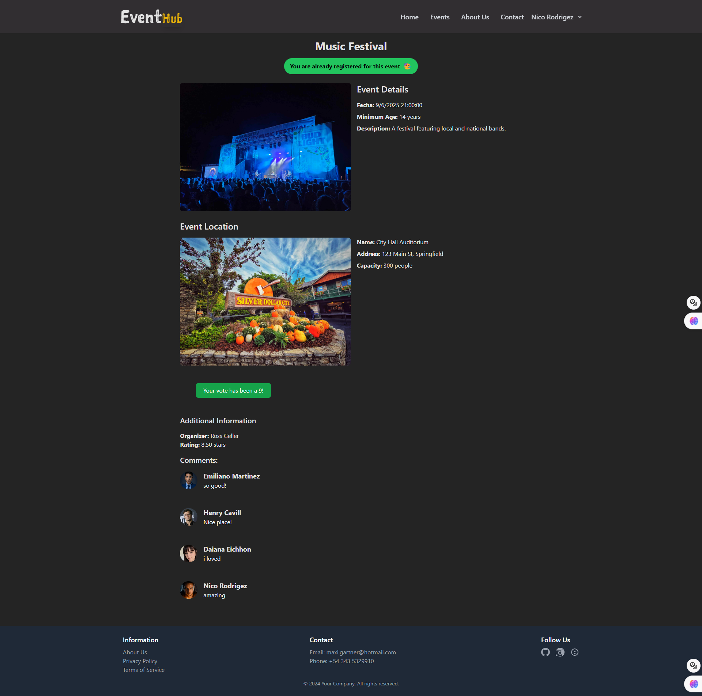
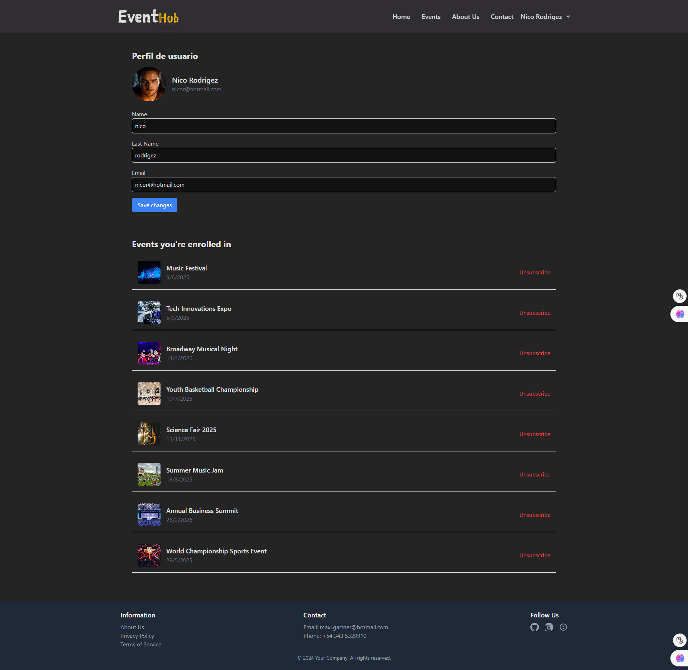
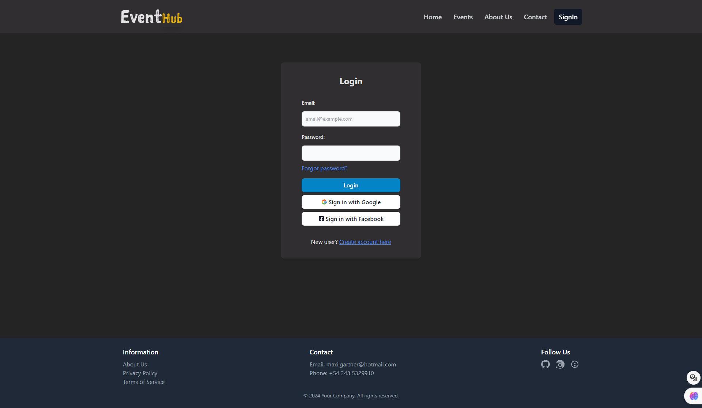
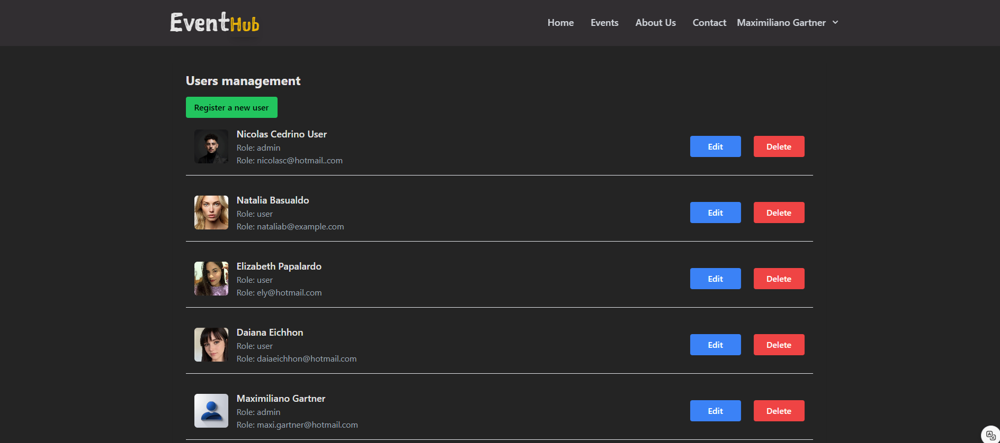
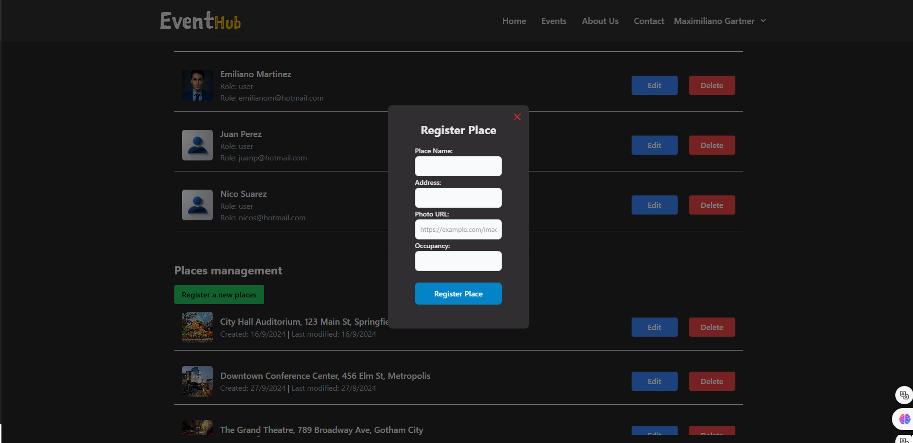
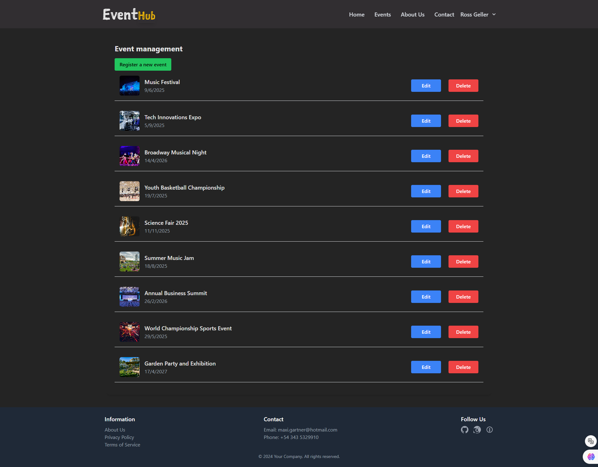

<h1>Proyecto Gestor de Eventos con React</h1>

<h2>🚀 Tecnologías Utilizadas</h2>

Este proyecto fue desarrollado usando las siguientes tecnologías:

<ul>
  <li><strong>React</strong> ⚛️ - Para crear interfaces de usuario interactivas.</li>
  <li><strong>JavaScript</strong> - El lenguaje que hace que todo funcione.</li>
  <li><strong>Tailwind CSS</strong> 🎨 - Para estilado rápido y modular.</li>
  <li><strong>Redux</strong> 🗃️ - Manejo de estado global.</li>
  <li><strong>Axios</strong> 🌐 - Para manejar las solicitudes HTTP.</li>
  <li><strong>SweetAlert</strong> 🍭 - Para alertas y notificaciones personalizadas.</li>
</ul>

<h2>🛠️ Instalación y Uso</h2>

Seguí estos pasos para correr el proyecto en tu entorno local:

<ol>
  <li>Cloná el repositorio:</li>

  <pre><code>git clone https://github.com/tuusuario/tu-repo.git](https://github.com/maxi-gartner/GestorDeEventosFront.git</code></pre>

  <li>Instalá las dependencias:</li>

  <pre><code>npm install</code></pre>

  <li>Corre el servidor localmente:</li>

  <pre><code>npm start</code></pre>

  
Si ya tienes el back, podés acceder a la app en <a href="http://localhost:4000">http://localhost:4000</a> 🎉.

</ol>

<h2>🗃️ Estructura del Proyecto</h2>

<pre><code>
├── public/
├── src/
│   ├── components/
│   │   ├── Navbar.js            # Componente de navegación
│   │   ├── Footer.js            # Componente de pie de página
│   │   └── Sidebar              # Componente Sidebar
│   ├── layouts/
│   │   ├── Layout.js            # Layout principal
│   ├── pages/
│   │   ├── modals/
│   │   │   ├── EditEvent.jsx         # Modal para editar un evento
│   │   │   ├── EditUser.jsx          # Modal para editar la información de un usuario
│   │   │   ├── RegisterEvent.jsx     # Modal para registrar un nuevo evento
│   │   │   └── RegisterPlace.jsx     # Modal para registrar un nuevo lugar
│   │   ├── AboutUs.jsx             # Página de información sobre la aplicación
│   │   ├── AdminPanel.jsx          # Panel de administración para gestionar usuarios y eventos
│   │   ├── Contact.jsx             # Página de contacto para consultas o soporte
│   │   ├── DetailsEvent.jsx        # Página con detalles específicos de un evento
│   │   ├── Events.jsx              # Página que lista todos los eventos disponibles
│   │   ├── Index.jsx               # Página de inicio de la aplicación
│   │   ├── SignIn.jsx              # Página de inicio de sesión
│   │   ├── SignUp.jsx              # Página de registro de nuevos usuarios
│   │   └── UserControlPanel.jsx    # Panel de control para el usuario, donde puede gestionar su perfil
│   ├── redux/
│   │   ├── actions/
│   │   │   ├── eventActions.js     # Acciones relacionadas con eventos
│   │   │   └── userActions.js      # Acciones relacionadas con usuarios
│   │   ├── reducers/
│   │   │   ├── eventReducer.js     # Reducer para eventos
│   │   │   ├── userReducer.js      # Reducer para usuarios
│   │   └── store.js                # Configuración del store de Redux
│   ├── router/
│   │   └── AppRouter.js            # Configuración de rutas
│   ├── services/
│   │   ├── alerts/
│   │   │   ├── swalAlert.js        # Servicio para mostrar alertas usando SweetAlert
│   │   ├── authQueries.js          # Consultas y funciones relacionadas con la autenticación
│   │   ├── eventQueries.js         # Consultas para obtener información sobre eventos
│   │   └── placesQueries.js        # Consultas para manejar lugares
│   ├── styles/
│   ├── App.js                      # Componente principal de la aplicación
│   └── main.js                     # Archivo de entrada principal
├── tailwind.config.js              # Configuración de Tailwind CSS
└── package.json                    # Dependencias y scripts del proyecto

</code></pre>

<h2>🚩 Características Principales</h2>

<ul>
  <li>🔥 <strong>Diseño Responsive</strong>: Gracias a Tailwind CSS, la app se adapta a cualquier dispositivo.</li>
  <li>🔄 <strong>Manejo de Estado Global</strong>: Redux para manejar el estado de toda la app de manera eficiente.</li>
  <li>🚀 <strong>Peticiones HTTP</strong>: Axios para interactuar con APIs externas.</li>
  <li>🍬 <strong>Alertas Personalizadas</strong>: SweetAlert para mejorar la experiencia de usuario con notificaciones amigables.</li>
</ul>

<h2>🖼️ Screenshots</h2>

  <h3>🏠 Pantalla de Inicio</h3>
  
  
  <h3>📅 Eventos</h3>
  
  
  <h3>📜 Detalles del Evento</h3>
  
  
  <h3>👤 Panel de Usuario</h3>
  
  
  <h3>🔑 Inicio de Sesión</h3>
  
  
  <h3>👥 Panel de Administración de Usuarios</h3>
  
  
  <h3>🏢 Panel de Administración de Lugares</h3>
  
  
  <h3>📝 Registro de Lugar en el Panel de Administración</h3>
  
  
  <h3>🎉 Panel de Organizador</h3>
  

<h2>🤝 Contribuir</h2>

Si querés contribuir a este proyecto, ¡sería genial! Podés hacer un fork del repositorio y abrir un pull request con tus cambios. También podés abrir un issue si encontrás algún bug.

<h2>📄 Licencia</h2>

Este proyecto está bajo la licencia <strong>MIT</strong>. Podés hacer lo que quieras con él, pero no olvides mencionar al autor original. 😜

--- ¡Gracias por pasarte y no dudes en dejar una estrellita ⭐ si te gusta el proyecto!

